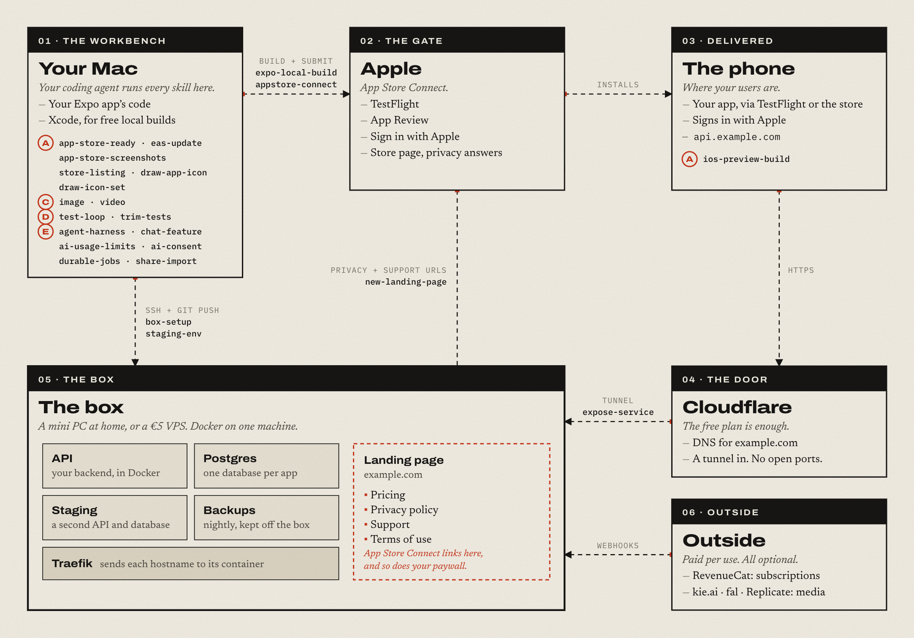

# onebox

Get your app on the App Store.

Agent skills and plain guides for getting an Expo / React Native app onto
the App Store. If the app needs a backend, it runs on one cheap server: a mini
PC at home or a small VPS. No AWS, no Kubernetes. iOS only for now: nothing
here covers Android or the Play Store yet.

Site and guides: https://onebox.lokkesveen.com · For agents: https://onebox.lokkesveen.com/llms.txt

## Install

In Claude Code:

```
/plugin marketplace add ggi3201/onebox
/plugin install start@onebox
```

Then open Claude Code in your app's folder and run `/start:plan`. It looks at
what the app already has, asks a few questions, and writes `PLAN.md`: the
steps in order, and the install line for each plugin you need. Run it again
later to tick what is done and see the next step. No app yet? Run
`/start:new-app` first. It makes the repo in the layout the other skills
expect.
[See an example plan](https://onebox.lokkesveen.com/example-plan/).

Other agents (Codex, Cursor, Gemini CLI and more):

```
npx skills add ggi3201/onebox
```

Then ask the agent to use the plan skill. I build and test with Claude Code.
The skills are plain `SKILL.md` files, so other agents can use them too.

To get fixes later, in Claude Code:

```
/plugin marketplace update onebox
/plugin update <plugin>@onebox
```

Then restart Claude Code. A plugin updates only when its version went up.

## The route

<picture>
  <source media="(prefers-color-scheme: dark)" srcset="docs/route-dark.png">
  
</picture>

Every skill runs in your coding agent on your Mac. The `box` skills reach your
server over SSH, and the landing page on the box holds the pricing, privacy
policy, support and terms pages that App Store Connect and your paywall link to.

## What is in the box

| Plugin | Runs on | Skills |
|---|---|---|
| `start` | your Mac | plan, new-app |
| `ship-ios` | your Mac | app-store-ready, expo-local-build, eas-update, appstore-connect, ios-preview-build, app-store-screenshots, store-listing, draw-app-icon, draw-icon-set |
| `box` | your server | box-setup, expose-service, new-landing-page, staging-env |
| `content` | your Mac | image, video |
| `dev` | your Mac | test-loop, trim-tests |
| `app-features` | your app and API | agent-harness, chat-feature, ai-usage-limits, ai-consent, durable-jobs, share-import |

## Setup

Skills read your values (Apple team, box host, domain, secrets tool) from
`~/.config/onebox/config.json` and an optional `.onebox.json` per app. Nothing
personal lives inside a skill. See [CONFIG.md](CONFIG.md).

Accounts and keys a skill cannot create for you are in [guides/](guides/).
Start with [guides/start-here.md](guides/start-here.md).

## Also good

Skills by other people that work well next to these. Each has its own
install steps and licence.

- [ponytail](https://github.com/DietrichGebert/ponytail): stops the agent from
  overbuilding.
- [impeccable](https://github.com/pbakaus/impeccable): design audits and polish
  for a landing page or app UI.
- [taste-skill](https://github.com/Leonxlnx/taste-skill): pushes UI away from the
  generic AI look.
- [emil-design-eng](https://github.com/emilkowalski/skills): motion, timing and
  polish.
- [RevenueCat ai-toolkit](https://github.com/RevenueCat/ai-toolkit): SDK setup
  and paywalls. `claude plugins marketplace add RevenueCat/ai-toolkit`.
- [frontend-design](https://github.com/anthropics/claude-plugins-official/tree/main/plugins/frontend-design):
  Anthropic's plugin. `/plugin install frontend-design@claude-plugins-official`.

## License

MIT. See [LICENSE](LICENSE) and [NOTICE.md](NOTICE.md) for third-party code.

Not affiliated with Apple, Expo or the other companies named here. Names and
trademarks belong to their owners.
